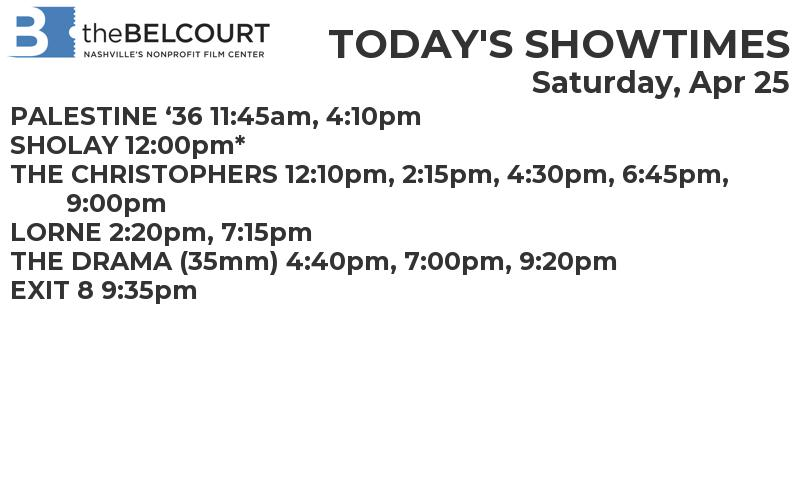

# inky-frame
Code powering my shiny new Inky Frame

Two projects are currently stored in this repository: 

* [`belcourt`](https://lindsay.codes/posts/webscraping-showtimes/) - a project that scrapes the Belcourt Theatre's website for the latest showtimes and displays them on the Inky Frame
* [`nashvillemta`](https://lindsay.codes/posts/realtime-bus-departure-board/) - a project queries the GTFS feed for the Nashville MTA bus system and displays the bus arrival times near a specific location on the Inky Frame

More details can be found at my website, linked to above.

Here is the latest output of the `belcourt` project:

